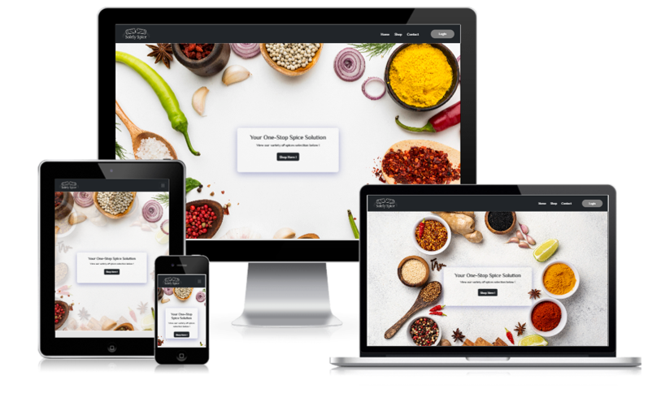
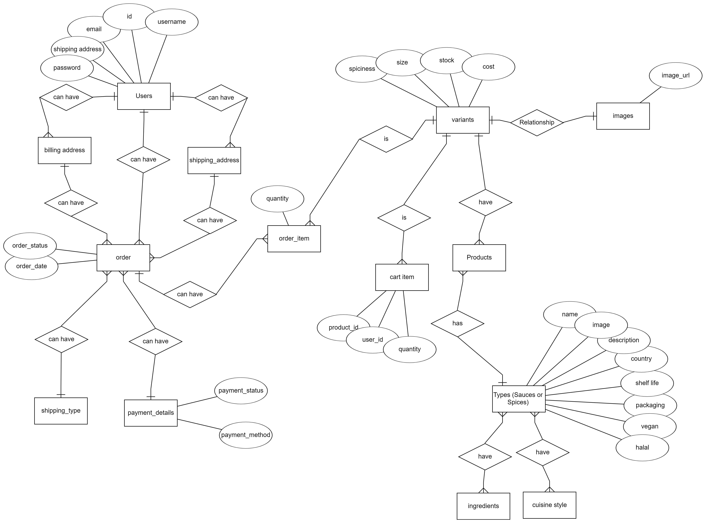
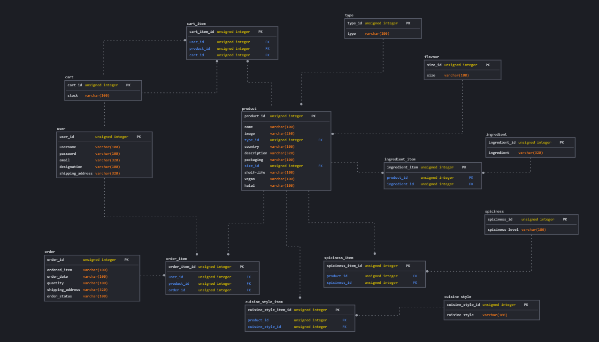
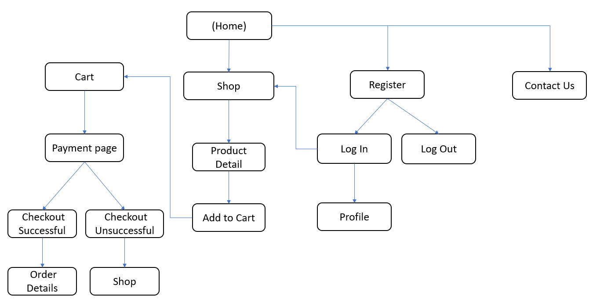
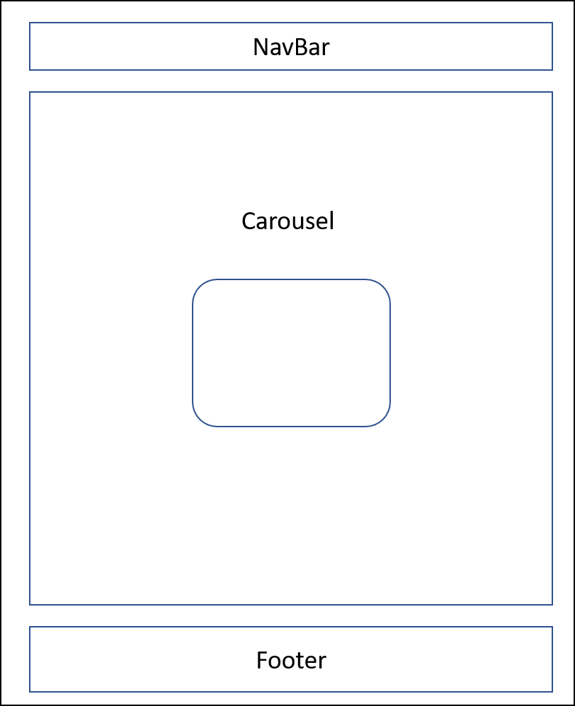

# tgc18-project3-frontend

- Objective: Create a sauces and spices e-commerce website for customers with different background or dietry constraint

* A brief layout of project work in different screen version



### References

<br>
Test Accounts for frontend react webpage customer login

| Email              | Password |
| ------------------ | -------- |
| testCust@gmail.com | 123      |

<br>

- Demo of frontend web application can be accessed [here](https://solely-spice.netlify.app/)

- Github frontend react interface please click [here](https://github.com/xunne899/tgc18-project3-frontend)

- Github backend database please click [here](https://github.com/xunne899/tgc18-backend-project3)

# Content

1. Summary of project
2. UX/UI
3. Features
4. User Stories
5. Technologies Used
6. Test Cases
7. Live Deployment
8. Credits and Acknowledgement

## 1. Summary

- Customers with religion or dietry constraints are not able to access easily to spices or sauces available to them at times
- In singapore i realised that there are not many e-commerce sauces and spice store cater to customers with dietry or religion constraints(eg. halal and vegan). As a owner of this project i would like to come up with an e-commerce store which allows customers to enjoy the freedom of purchasing spices and sauces regardless of their dietry contraints or background

### ERD



### Schema



## 2. UI/UX

### 2.1 Scope

The purpose of this project is to let public, mainly millennials young adults (21 years) to (45 years) to be aware that there is a site online which allows them to purchase spices and sauces regardless of their dietry constraints or background.

### 2.2 Strategy

- To create a e-commerce to allow customer's to purchase different spices and sauces from
  webpage
- For frontend of website , Consumers are able to register and log in, adding items to cart and eventually check out to payment page. For backend admin site, Owner or company staff is able to manage the order and update status of products, notify customers when the order is ready to dispatch.
- Allowing Owner to add, edit, update, upload image, manage order update status and delete the spices and sauces in the admin backend website

#### 2.2.a. User Goals

- Targeted Audience: Millennials young adults (21 years) to (45 years)
- Users are able to find their desired spices and sauces
- Interface of the website is user friendly, users able to login, navigate to their products with ease
- Users are able to obtain ingredients and other information of the sauces and spices they are purchasing quickly

#### 2.2.b. Organisation's Goals

- Able to provide a sauces and spices e-commerce website for customers with different background or dietry constraint

### 2.3 Structure

Users are able to access to various applications through the navigation bar. The image below shows a flowchart of how different features can be accessed.

<br>



### 2.4 Skeleton

Webpage consists of simple 3 components

- Navbar
- Body
- Footer

1. Navbar is located at the top of webpage.<br>
2. Navbar consists of logo, able to link to home page when on click and other tab hyperlinks to respective pages.<br>
3. Login user (Navbar Login) will then able to view tabs like profile, cart items, orders, logout<br>
4. Body consists of Carousel with 3 Main background Image, box in middle of background with shop now button<br>
5. Footer at the bottom page with copyright consist of github linkedin, email logo.<br>



### 2.5 Surface

#### 2.5.a Background<br>

- Background Colors: Mainly Black and white - To allow products to stand out capture viewers attention <br>
- Button Colors : Black / Grey <br>


#### 2.5.b Typography<br>

- Font Color : Black
- Font Family :'ZCOOL XiaoWei', serif
- Font Size : 0.6 - 4 rem, vh, wh, px, h1 to h5 for headings to match with background settings

#### 2.5.c Images<br>

- Images : Different images used for the main page
- Website is able to view in mobile size (XS), midsize view and large display like desktop

#### 2.5.c Icons<br>

- Icons are used in footer and navbar
- Icons under footer are linkedin github and email
- Navbar person icon will be seen when user log in

## 3. Features<br>

### Key features

Front-end

1. Able to show Products on the home page
2. Customer able to register and log in
3. Customer able to view products on site
4. Customer able to Add, delete, update the cart items
5. Checkout and make payment
6. Payment success notification

Back-end (admin site)

1. Admin/Staff/Owner able to log in/register
2. Able to Create, update, delete products at the backend side
3. Able to Process and Manage order
4. Able to manage admin profile

## 4. User Stories

1. User's are able to access the website with ease, able to view products add to cart and make payment within few simple steps
2. User's are able to browse their product details and at a quick glance
3. User's are able to register and log in over few simple steps
4. User's are able to view order item details, receipt easily and within a few clicks

### 4.1 Acceptance Criteria

1. Webpage products description layout able to capture user's attention <br>
2. Webpage is user friendly enough, allowing customer's to navigate to register, login, search for their item with ease<br>
3. Webpage allows user to purchase their item, checkout within a few steps<br>
4. Allows user to view products and ordered items detail eg. payment method, address, order id, order status, shipping method and receipt

## 5. Technologies Used

### FrontEnd

- HTML - styling, font size,form size, color
- CSS - styling, font size,form size, color
- React- frontend programming
- Axios - importing data, posting data, HTTP client to endpoint
- Bootstrap - styling, sizing, aligning content, match its mobile responsiveness
- React Boostrap 5.0 - accordian, cards ,modal, forms, col, rows
- Canva - creating logo brand
- Netlify - hosting live for frontend webpage project
- createmockup - readme file, sample of different view layout
- Github & Gitpod - storing respositories/project

### Backend

- knex
- CORS
- doteenv file
- db-migrate - migrate backend files
- Bookshelf- backend database
- hbs - for backend file display
- SQL- backend database
- Express Node JS- Backend programming
- DB Beaver, postgress - store backend data after live deployment
- SweetAlert2 - alert box for successfully deleted and added
- Bootstrap - styling, sizing, aligning content, match its mobile responsiveness
- React Boostrap 5.0 - accordian, cards ,modal, forms, col, rows
- Heroku - hosting live for backend project
- Github & Gitpod - storing respositories/project

## 6. Testing

### Test Cases

#### PDF

- Test case for each feature can be found [here](./test_case.pdf).
- Please download the file for better view

#### Excel

- Test case for each feature can be found [here](./test_case.xlsx).
- Please download the file for better view

### Mobile Responsiveness

Responsiveness testing was done on Small handphones SE, Tablet, General Desktop and Laptop size.

## 7. Live Deployment

- Deployment is through Netlify for react frontend<br>
  Link of live Netlify deployment can be found [here](https://solely-spice.netlify.app/)

- Deployment is through heroku for backend database<br>
  Link of live HEROKU deployment can be found [here](https://project3-spice-sauce.herokuapp.com/login)


### Backend Environment Variables

#### This project makes use of the environment variables as shown below:
```
DB_DRIVER=
DB_USER=
DB_PASSWORD=
DB_DATABASE=
DB_HOST=

CLOUDINARY_NAME=
CLOUDINARY_API_KEY=
CLOUDINARY_API_SECRET=
CLOUDINARY_UPLOAD_PRESET=

STRIPE_PUBLISHABLE_KEY=
STRIPE_SECRET_KEY=
STRIPE_SUCCESS_URL=
STRIPE_CANCELLED_URL=
STRIPE_ENDPOINT_SECRET=

SESSION_SECRET_KEY=

TOKEN_SECRET=
REFRESH_TOKEN_SECRET=
```

## 8. Credits and Acknowledgement

### Credits to:

#### Web Source

[Bootstrap](https://getbootstrap.com/docs/5.0/getting-started/introduction/)( features, listgroups,web features) <br>
[color-hex.com](https://www.color-hex.com/color/)(background color scheme png in readme file)<br>
[Canva](https://www.canva.com)(creating logo brand)<br>
[Cart2](https://icons.getbootstrap.com/icons/cart2/)(cart icon)<br>
[getbootstrapicon](https://icons.getbootstrap.com/icons/)(font awesome github, email, linkedin,for footer and user navbar login person icon)<br>
[SweetAlert2](https://sweetalert2.github.io/)(alert box for successfully deleted and added)<br>
[React Bootstrap 5.0](https://react-bootstrap.github.io/)(accordian, cards ,modal)<br>
[createmockup](https://www.createmockup.com/generate/)(readme file desktop view layout)><br>
[freepik](https://www.freepik.com/)(web background images)<br>
[Google Fonts](https://fonts.google.com/)(webpage overall font-family)<br>
[Anthony the spice maker](https://www.anthonythespicemaker.com/)(spice picture in products and variants page)<br>
[Stinky and Scorchy ](https://stinkyandscorchy.ie/?s=dr+trouble)(sauce picture in products and variants page)<br>
[DB Beaver](https://dbeaver.io/)(store backend data after deployment)<br>
[Postgress](https://www.postgresql.org/)(store backend data after deployment)<br>
[GitHub](https://github.com/)(commit and store workspace)<br>
[GitPod](https://gitpod.io/workspaces)(commit and store workspace)<br>

#### Mentors

- Guidance from Paul Chor(Head Instructor)
- Guidance from All Teaching Assistants
- Guidance from Batch 18 Trent Global Coursemates
